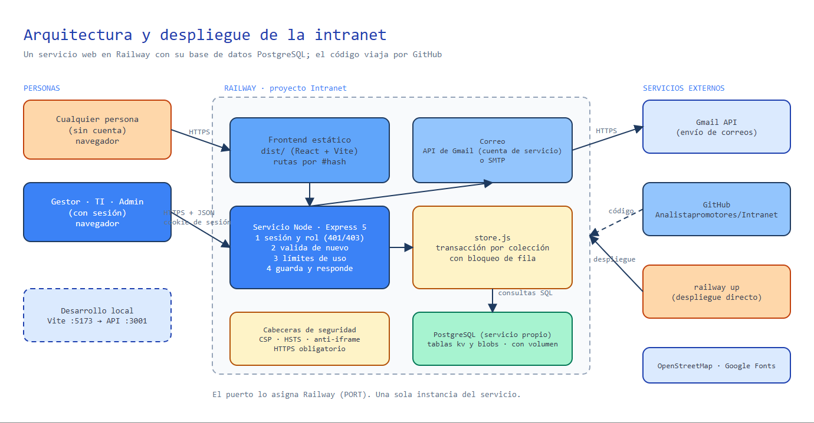

# Despliegue

Esta guía explica **dónde está la intranet, cómo publicar un cambio, cómo reiniciarla y qué configuración usa**.
Diagrama editable: [diagramas/arquitectura.excalidraw](diagramas/arquitectura.excalidraw).



## Dónde está

| Dato | Valor |
| --- | --- |
| Plataforma | [Railway](https://railway.com), cuenta `analistapromotores` |
| Proyecto / entorno | `Intranet` (id `00240132-9c74-4a5c-880c-def01fd58314`) / `production` |
| Sitio público | https://intranet-production-a9d0.up.railway.app |
| Repositorio | https://github.com/Analistapromotores/Intranet (rama `main`) |
| Servicios del proyecto | **`Intranet`** (Node + frontend) y **`Postgres`** (base de datos con volumen persistente) |
| Comprobación de salud | `GET /api/health` → `{"ok":true,"db":"postgres"}` |

## Qué corre y en qué puerto

Un contenedor Node 22 ([Dockerfile](../Dockerfile)) construido en dos etapas:

1. **build:** `npm ci` + `npm run build` → genera `dist/` (frontend estático).
2. **runtime:** `npm ci --omit=dev`, copia `dist/`, `server/` y `shared/`, y arranca `node server/index.js`.

| Aspecto | Detalle |
| --- | --- |
| Puerto | Lo asigna Railway en `PORT`; el servidor lo lee (`PORT` → `API_PORT` → `3001`) |
| Qué sirve | `/api/*` (API), `/uploads/*` (imágenes), `/robots.txt`, `/sitemap.xml` y el resto → `index.html` (rutas por hash) |
| `NODE_ENV` | `production` (lo fija el Dockerfile): cookie `Secure`, HSTS, redirección a HTTPS |
| Chequeo de salud | `healthcheckPath: /api/health` en [railway.json](../railway.json); Railway espera respuesta antes de activar un despliegue |
| Reinicio automático | `ON_FAILURE`, hasta 3 reintentos |
| Instancias | Una instancia del servicio |
| Desarrollo local | `localhost:5173` (web, Vite) y `localhost:3001` (API) |

## Variables del servicio

Se definen en Railway → servicio `Intranet` → *Variables*. La lista completa, con su significado, está en
[README.md](../README.md#variables-de-entorno).

| Grupo | Variables |
| --- | --- |
| Base de datos | `DATABASE_URL` = `${{Postgres.DATABASE_URL}}` (referencia al servicio Postgres) |
| Sesión y usuarios iniciales | `SESSION_SECRET`, `ADMIN_USER`/`ADMIN_PASSWORD`, `GESTOR_USER`/`GESTOR_PASSWORD`, `TI_USER`/`TI_PASSWORD` |
| Correo | `GOOGLE_SERVICE_ACCOUNT_JSON`, `GMAIL_SENDER`, `MAIL_MODE`, `EMAIL_PRUEBAS`, `EMAIL_PRODUCCION`, `EMAIL_PRESTAMOS`, `EMAIL_TI` |
| Sitio | `SITE_URL` (opcional; por defecto se toma del host) |

Los usuarios iniciales se crean al arrancar **solo si no existen**. Después se administran desde
*Administración → Accesos y roles*.

## Cómo desplegar

### Subida directa con la CLI

```bash
cd Intranet
railway link -p 00240132-9c74-4a5c-880c-def01fd58314 -e production -s Intranet   # una vez
railway up --detach -s Intranet                                                   # sube la carpeta
railway logs -s Intranet                                                          # ver el arranque
```

[.railwayignore](../.railwayignore) deja fuera `node_modules`, `dist`, `data` y el material en bruto (videos y
fotos originales) para que la subida sea liviana.

El script [deploy-railway.ps1](../../deploy-railway.ps1) automatiza la validación y el despliegue:

```powershell
.\deploy-railway.ps1 -Direct -Logs        # valida (lint + build), sube con railway up y muestra logs
```

### Por GitHub

```bash
git add -A && git commit -m "Describe el cambio" && git push origin main
```

El código fuente vive en GitHub como respaldo y punto de colaboración. Si se conecta el servicio al repositorio
(*Settings → Source → Connect Repo*, rama `main`), cada `push` despliega solo.

### Antes de desplegar

1. `npm run lint` y `npm run build` sin errores.
2. `npm ci` debe funcionar: `package-lock.json` tiene que estar sincronizado con `package.json` (el Dockerfile usa
   npm 10; si cambias dependencias, regenera el lock con `npx npm@10 install --package-lock-only`).

### Cómo verificar que quedó bien

1. `railway deployment list -s Intranet` muestra el último despliegue en `SUCCESS`.
2. `https://intranet-production-a9d0.up.railway.app/api/health` responde `{"ok":true,"db":"postgres"}`.
3. La portada carga, el carrusel avanza y puedes iniciar sesión.

## Reiniciar y volver atrás

| Necesidad | Cómo |
| --- | --- |
| Reiniciar sin cambiar código | Railway → servicio → *Deployments → ⋯ → Redeploy* (o `railway redeploy -s Intranet -y`) |
| Volver a una versión anterior | *Deployments* → despliegue anterior → *Rollback* |
| Cambiar una variable | Editarla en *Variables*; Railway redespliega solo |

Reiniciar o redesplegar **no borra datos**: viven en el servicio `Postgres`, que tiene su propio volumen.

## Base de datos

- Servicio `Postgres` del mismo proyecto, comunicado por la red privada de Railway (`DATABASE_URL` es una referencia).
- Tablas `kv` y `blobs`, creadas al arrancar si no existen ([erd.md](erd.md#cómo-se-almacena)).
- **Respaldo manual:** `railway connect Postgres` abre `psql`; con `pg_dump` sobre la URL pública del servicio se
  obtiene una copia completa. Railway permite además programar copias del volumen desde el panel del servicio Postgres (según el plan contratado).
- **Cargar datos de desarrollo:** `DATABASE_URL=<url pública> npm run db:migrar`.

## Seguridad HTTP

Todo se aplica en el servidor ([server/seguridad.js](../server/seguridad.js)); en el hosting no hay nada que activar
aparte del dominio y HTTPS que Railway ya gestiona.

| Medida | Configuración |
| --- | --- |
| HTTPS | Railway termina TLS; `X-Forwarded-Proto: http` se redirige con 301 a `https://` |
| HSTS | `max-age=15552000; includeSubDomains` (solo en producción) |
| Cookie de sesión | `HttpOnly; Secure; SameSite=Lax`, 12 horas |
| CSP | `default-src 'self'`; scripts solo propios; estilos propios y Google Fonts; imágenes `https:`; marcos solo de YouTube, Vimeo, Instagram, Facebook, LinkedIn, TikTok y Google Drive/Docs; `object-src 'none'`; `frame-ancestors 'self'` |
| Otras cabeceras | `X-Content-Type-Options: nosniff`, `X-Frame-Options: SAMEORIGIN`, `Referrer-Policy: strict-origin-when-cross-origin`, `Permissions-Policy` restrictivo |
| CORS | No se habilita: la web y la API comparten origen |
| Proxy | `trust proxy = 2` para obtener la IP real del cliente ([reglas-de-negocio.md](reglas-de-negocio.md#seguridad-y-límites-de-uso)) |
| Compresión y caché | gzip/brotli; `/assets/*` con hash en caché por un año; `index.html` sin caché |

Si se agrega un servicio externo nuevo (otro proveedor de video, mapas, etc.), hay que añadir su dominio a la CSP en
`server/seguridad.js`.

## SEO y enlaces compartidos

- `title` y `description` por sección (se actualizan al navegar), enlace canónico, Open Graph y Twitter Card con la
  imagen `public/og-image.png` (1200 × 630, logo de Gestión y Servicios).
- `robots.txt` permite la portada y bloquea `/api/`; `sitemap.xml` lista la portada. Ambos se generan con la
  dirección pública del sitio: `https://intranet-production-a9d0.up.railway.app/robots.txt` y `/sitemap.xml`.
- Las secciones usan `#`, que los buscadores tratan como parte de la misma página.
- Una URL inexistente muestra la página 404 de la intranet; un archivo inexistente responde 404 real.

## Diagnóstico

| Síntoma | Qué mirar |
| --- | --- |
| Despliegue en `FAILED` | `railway logs <id> -s Intranet --build`: normalmente `npm ci` (lock desincronizado) o un error de `vite build` |
| El sitio responde 502 | El servidor debe escuchar en `PORT`; revisa el log de arranque: `[intranet] http://localhost:<PORT> · datos en PostgreSQL` |
| Nadie puede iniciar sesión | Define `ADMIN_USER`/`ADMIN_PASSWORD` (o crea usuarios desde Administración) y redespliega |
| Piden iniciar sesión otra vez tras cada despliegue | Define `SESSION_SECRET` |
| Errores 429 | Se alcanzó un límite de uso (login, felicitaciones, reservas, solicitudes); esperar unos minutos |
| Los correos van al buzón de pruebas | `MAIL_MODE` no es `produccion` |
| Un servicio externo no carga (video, mapa) | Revisar la CSP en `server/seguridad.js` |

## Desarrollo local y producción

| | Local | Producción |
| --- | --- | --- |
| Web | Vite en `:5173` (proxy a `/api`) | El mismo Express sirve `dist/` |
| API | `node --watch` en `:3001` | `node server/index.js` en `$PORT` |
| Datos | Archivos en `./data` (o PostgreSQL con `DATABASE_URL`) | PostgreSQL |
| Usuarios | `gestor`, `ti`, `admin` de desarrollo | Los definidos en variables y en Administración |
| Cookie | Sin `Secure` | `Secure` (HTTPS) |
| Correo | Bandeja del sistema (`.eml`) | Gmail API o SMTP |
