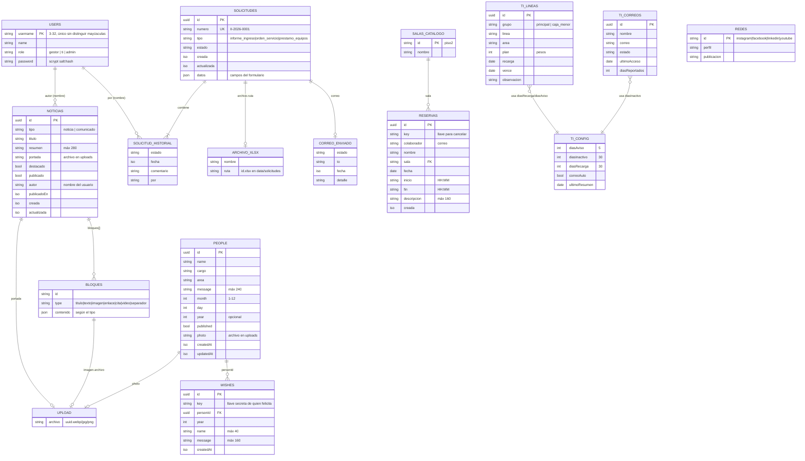

# Modelo de datos (ERD)

> **Para quién es:** quien necesita saber **qué se guarda, dónde y cómo se relaciona** antes de tocar el
> servidor, migrar a una base de datos o construir un reporte. Al terminar sabrás qué archivo contiene cada
> entidad y qué campo enlaza con qué.

La intranet **no usa una base de datos**: cada colección es un archivo JSON dentro de `DATA_DIR`
(`./data` en local, el volumen en Railway). Este ERD es, por eso, un **modelo lógico**: las «claves foráneas»
son campos que el código respeta, no restricciones que un motor haga cumplir.

Diagrama editable: [diagramas/erd.excalidraw](diagramas/erd.excalidraw) (ábrelo en <https://excalidraw.com>).

## Diagrama

## Dónde vive cada entidad

| Entidad | Archivo en `DATA_DIR` | Forma del archivo | Código que la maneja |
| --- | --- | --- | --- |
| Usuarios | `users.json` | `[ usuario ]` | [server/index.js](../server/index.js) |
| Personas (cumpleaños) | `people.json` | `[ persona ]` | [server/index.js](../server/index.js) |
| Felicitaciones | `wishes.json` | `[ felicitación ]` | [server/index.js](../server/index.js) |
| Noticias y comunicados | `noticias.json` | `{ items: [ publicación ] }` | [server/noticias/routes.js](../server/noticias/routes.js) |
| Redes sociales | `redes.json` | `{ items: [ red ] }` | [server/noticias/routes.js](../server/noticias/routes.js) |
| Solicitudes | `solicitudes.json` | `{ consecutivos: { "II-2026": 3 }, items: [ … ] }` | [server/solicitudes/routes.js](../server/solicitudes/routes.js) |
| Excel de solicitudes | `solicitudes/<id>.xlsx` | binario | ídem |
| Reservas de salas | `reservas.json` | `{ items: [ reserva ] }` | [server/salas/routes.js](../server/salas/routes.js) |
| Líneas móviles | `ti-lineas.json` | `{ items: [ línea ] }` (se siembra sola la primera vez) | [server/ti/routes.js](../server/ti/routes.js) |
| Correos (reporte de inactivos) | `ti-correos.json` | `{ actualizado, items: [ correo ] }` | ídem |
| Configuración de alertas de TI | `ti-config.json` | `{ diasAviso, diasInactivo, diasRecarga, correoAuto, ultimoResumen }` | ídem |
| Fotos e imágenes subidas | `uploads/<uuid>.webp|jpg|png` | binario, servido en `/uploads` | varios |
| Correos simulados | `outbox/*.eml` | solo si no hay SMTP | [server/solicitudes/mailer.js](../server/solicitudes/mailer.js) |

Catálogos que **no** están en archivos sino en código compartido: salas ([shared/salas.js](../shared/salas.js)),
tipos y estados de solicitud, catálogos de formularios ([shared/solicitudes.js](../shared/solicitudes.js)).

## Cómo se relacionan (y dónde la relación es débil)

| Relación | Cómo se enlaza | Detalle importante |
| --- | --- | --- |
| Persona → Felicitaciones | `wishes.personId = people.id` | Al **borrar una persona** se borran sus felicitaciones y su foto |
| Publicación → autor | `noticias.autor` guarda el **nombre** | No es `username`: si renombras al usuario, la publicación conserva el nombre viejo |
| Solicitud → historial | Lista incrustada en la solicitud | `por` guarda el nombre de quien cambió el estado, o el solicitante en el primer registro |
| Solicitud → Excel | `archivo.ruta = <id>.xlsx` | Se regenera con «reenviar»; el archivo anterior se sobrescribe |
| Publicación/bloque/persona → imagen | Nombre de archivo en `uploads` | Al editar o borrar, las imágenes que ya no se usan se eliminan del disco |
| Reserva → sala | `reservas.sala = SALAS[].id` | Si quitas una sala del catálogo, sus reservas quedan huérfanas |
| Reserva → dueño | `colaborador` (correo) + `key` secreta | No hay usuario: cancelar exige la `key` o una sesión |
| Solicitud → solicitante | Correo dentro de `datos` | La consulta pública exige **número + correo** |

## Numeración de solicitudes

`numero = <prefijo>-<año>-<consecutivo de 4 dígitos>`, por ejemplo `OS-2026-0007`. Prefijos: `II` (Informe de
Ingreso), `OS` (Orden de Servicio), `PE` (Préstamo de equipos). El consecutivo se guarda en
`solicitudes.json → consecutivos["OS-2026"]` y **reinicia cada año**.

## Por qué archivos JSON

Es una decisión deliberada, no un descuido; el propio código la documenta
([server/store.js](../server/store.js)): el volumen de la intranet es bajo (una intranet interna de una empresa, no un
sistema transaccional) y un archivo por colección permite desplegar **sin servicios adicionales** ni migraciones.

Lo que hace seguro este enfoque:

- **Escritura atómica:** se escribe un `.tmp` y se renombra, así un corte a mitad de escritura no deja un JSON roto.
- **Cola en serie:** todas las escrituras pasan por una promesa encadenada; dos peticiones simultáneas nunca
  se pisan (`update()` lee, modifica y guarda dentro de la misma cola).

Sus límites, para saber cuándo migrar:

- **Un solo proceso.** Con dos réplicas del servicio cada una tendría su copia de la cola y podrían pisarse.
  Railway debe correr con **una** instancia.
- **Sin consultas ni índices:** cada lectura carga el archivo completo. Cuando `solicitudes.json` o
  `noticias.json` pasen de varios MB, conviene migrar.
- **Requiere volumen persistente:** sin `DATA_DIR` apuntando a un volumen, todo se pierde en cada despliegue
  (ver [despliegue.md](despliegue.md)).

Migrar a una base de datos toca `store.js` y los routers que lo llaman (`readJson`, `writeJson`,
`update`); el frontend habla con la API HTTP y no cambia.
