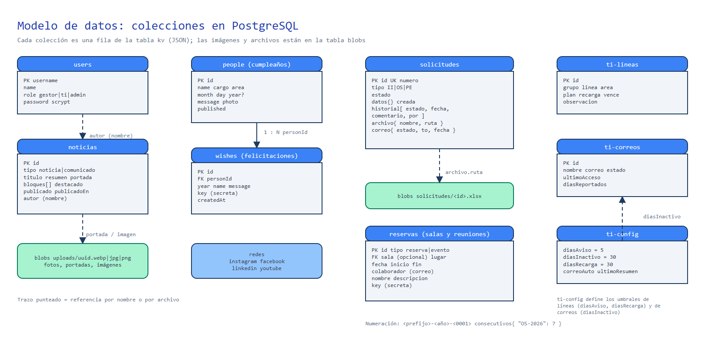
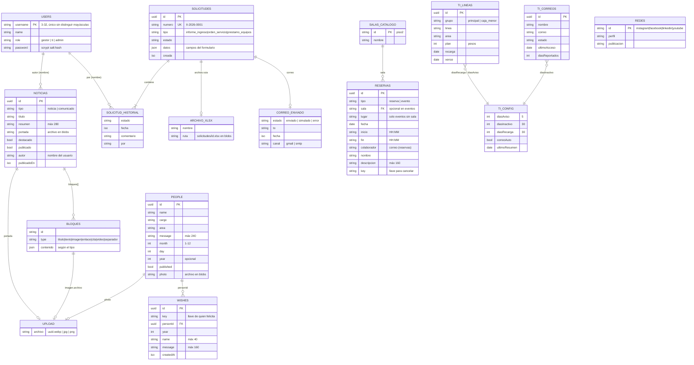

# Modelo de datos (ERD)

Esta guía explica **qué se guarda, dónde y cómo se relaciona**, para consultar, construir reportes o ampliar el
sistema. Diagrama editable: [diagramas/erd.excalidraw](diagramas/erd.excalidraw) (ábrelo en <https://excalidraw.com>).



## Cómo se almacena

Los datos viven en **PostgreSQL** (servicio propio en Railway, con volumen persistente) y se organizan en dos tablas:

| Tabla | Contenido | Columnas |
| --- | --- | --- |
| `kv` | Una fila por **colección** (usuarios, personas, noticias, solicitudes…) | `name` (PK, p. ej. `people.json`), `data` (jsonb), `updated_at` |
| `blobs` | **Archivos**: fotos, imágenes de noticias, Excel generados, correos guardados | `name` (PK, p. ej. `uploads/<uuid>.webp`), `mime`, `data` (bytea), `created_at` |

Cada modificación se hace dentro de una **transacción con bloqueo de fila** (`SELECT … FOR UPDATE`): dos peticiones
simultáneas sobre la misma colección se ejecutan una tras otra, sin pisarse. Por eso los consecutivos de las
solicitudes y las reservas de una sala nunca se duplican. Las lecturas son directas.

Al arrancar, el servidor crea las tablas si no existen y espera a la base hasta 20 segundos. En desarrollo, sin
`DATABASE_URL`, la misma interfaz guarda las colecciones como JSON en `data/` y los archivos en `data/blobs/`.

## Diagrama entidad-relación



## Dónde vive cada entidad

| Entidad | Nombre en `kv` / `blobs` | Forma del dato | Código |
| --- | --- | --- | --- |
| Usuarios | `users.json` | `[ usuario ]` | [server/index.js](../server/index.js) |
| Personas (cumpleaños) | `people.json` | `[ persona ]` | [server/index.js](../server/index.js) |
| Felicitaciones | `wishes.json` | `[ felicitación ]` | [server/index.js](../server/index.js) |
| Noticias y comunicados | `noticias.json` | `{ items: [ publicación ] }` | [server/noticias/routes.js](../server/noticias/routes.js) |
| Redes sociales | `redes.json` | `{ items: [ red ] }` | [server/noticias/routes.js](../server/noticias/routes.js) |
| Solicitudes | `solicitudes.json` | `{ consecutivos: { "II-2026": 3 }, items: [ … ] }` | [server/solicitudes/routes.js](../server/solicitudes/routes.js) |
| Reservas y reuniones | `reservas.json` | `{ items: [ reserva | evento ] }` | [server/salas/routes.js](../server/salas/routes.js) |
| Líneas móviles | `ti-lineas.json` | `{ items: [ línea ] }` | [server/ti/routes.js](../server/ti/routes.js) |
| Correos (reporte de inactivos) | `ti-correos.json` | `{ actualizado, items: [ correo ] }` | ídem |
| Configuración de alertas de TI | `ti-config.json` | `{ diasAviso, diasInactivo, diasRecarga, correoAuto, ultimoResumen }` | ídem |
| Fotos e imágenes | `blobs`: `uploads/<uuid>.webp\|jpg\|png` | binario, servido en `/uploads/<archivo>` | varios |
| Excel de solicitudes | `blobs`: `solicitudes/<id>.xlsx` | binario | [server/solicitudes/routes.js](../server/solicitudes/routes.js) |
| Correos guardados (sin Gmail ni SMTP) | `blobs`: `outbox/*.eml` | RFC 822 | [server/solicitudes/mailer.js](../server/solicitudes/mailer.js) |

Los catálogos de salas, tipos y estados de solicitud y opciones de formularios están en código compartido:
[shared/salas.js](../shared/salas.js) y [shared/solicitudes.js](../shared/solicitudes.js).

## Relaciones

| Relación | Cómo se enlaza | Detalle |
| --- | --- | --- |
| Persona → Felicitaciones | `wishes.personId = people.id` | Al eliminar una persona se eliminan sus felicitaciones y su foto |
| Publicación → autor | `noticias.autor` guarda el nombre | Conserva el nombre con el que se publicó |
| Solicitud → historial | Lista incrustada | `por` guarda el nombre de quien cambió el estado; en el primer registro, el solicitante |
| Solicitud → Excel | `archivo.ruta = <id>.xlsx` | «Reenviar» lo regenera y reemplaza |
| Publicación, bloque o persona → imagen | Nombre de archivo en `blobs` | Las imágenes que dejan de usarse se eliminan |
| Reserva → sala | `reservas.sala = SALAS[].id` | Los eventos pueden ir sin sala (con `lugar`) |
| Reserva → dueño | `colaborador` (correo) + `key` | Cancelar exige la `key` o una sesión (los eventos, sesión de administrador) |
| Solicitud → solicitante | Correo o cédula dentro de `datos` | La consulta pública busca por cédula o por correo |

## Numeración de solicitudes

`numero = <prefijo>-<año>-<consecutivo de 4 dígitos>`, por ejemplo `OS-2026-0007`. Prefijos: `II` (Informe de Ingreso),
`OS` (Orden de Servicio) y `PE` (Préstamo de equipos). El consecutivo se guarda en
`solicitudes.json → consecutivos["OS-2026"]`, se asigna dentro de la misma transacción que crea la solicitud y
reinicia cada año.

## Consultas de ejemplo

```sql
-- Colecciones y su tamaño
SELECT name, pg_column_size(data) AS bytes, updated_at FROM kv ORDER BY name;

-- Solicitudes por estado
SELECT s->>'estado' AS estado, count(*)
FROM kv, jsonb_array_elements(data->'items') s
WHERE name = 'solicitudes.json' GROUP BY 1;

-- Archivos guardados y su peso
SELECT split_part(name, '/', 1) AS carpeta, count(*), pg_size_pretty(sum(length(data))) FROM blobs GROUP BY 1;
```
