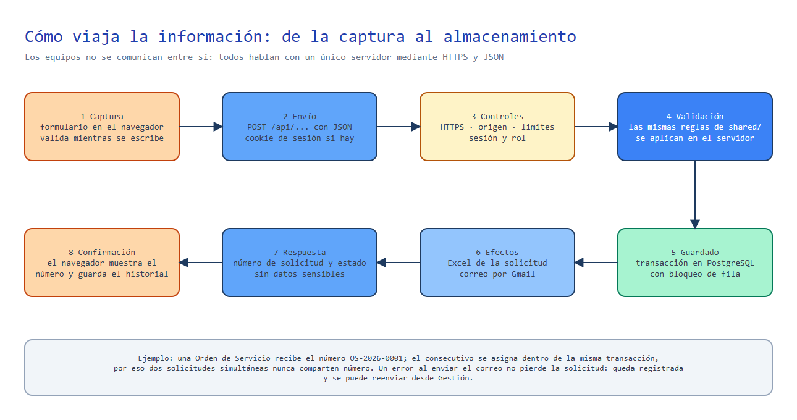

# Usuarios y permisos

Esta guía explica **quién puede hacer qué**, cómo se controlan los accesos y cómo viaja la información entre el equipo
de cada persona y el servidor. Diagrama editable: [diagramas/roles-y-accesos.excalidraw](diagramas/roles-y-accesos.excalidraw).

## Idea central

La intranet tiene **dos zonas**:

- **Zona pública (sin cuenta):** cualquier persona de la empresa que abra la intranet ve la portada, las noticias
  publicadas y el calendario; puede felicitar, registrar solicitudes, consultarlas, reservar salas y descargar el
  formato de ausentismo. No se pide usuario para que usarla sea inmediato.
- **Zona de gestión (con cuenta):** publicar noticias, administrar cumpleaños, gestionar solicitudes, panel de TI,
  reuniones del calendario y administración de usuarios. Aquí hay inicio de sesión y **tres roles**.

## Roles

| Rol | Es quien… | Alcance |
| --- | --- | --- |
| `gestor` | Comunicaciones / Talento Humano | Cumpleaños, noticias y comunicados, redes sociales, gestión de solicitudes |
| `ti` | Equipo de sistemas | Todo lo del gestor **más** el Panel de TI (líneas móviles y correos inactivos) |
| `admin` | Administración de la intranet | **Todo**, más Accesos y roles y las reuniones del calendario |

Los roles se acumulan hacia arriba: `ti` y `admin` hacen todo lo del `gestor`; `admin` hace todo lo de `ti`.

## Qué puede hacer cada rol

✅ permitido · — no permitido · 🔑 con la llave que recibió al crearlo

| Acción | Sin cuenta | gestor | ti | admin |
| --- | :---: | :---: | :---: | :---: |
| Ver portada, noticias publicadas, cumpleaños, redes y calendario | ✅ | ✅ | ✅ | ✅ |
| Ver un borrador de noticia | — | ✅ | ✅ | ✅ |
| Felicitar a un cumpleañero (ventana de 3 días) | ✅ | ✅ | ✅ | ✅ |
| Cambiar mi propia felicitación | 🔑 | ✅ | ✅ | ✅ |
| Registrar una solicitud (ingreso, orden, préstamo) | ✅ | ✅ | ✅ | ✅ |
| Consultar solicitudes por cédula o correo | ✅ | ✅ | ✅ | ✅ |
| Reservar una sala | ✅ | ✅ | ✅ | ✅ |
| Cancelar una reserva | 🔑 | ✅ cualquiera | ✅ cualquiera | ✅ cualquiera |
| Generar el formato de ausentismo | ✅ | ✅ | ✅ | ✅ |
| Crear y cancelar **reuniones** del calendario | — | — | — | ✅ |
| Crear, editar, publicar y eliminar noticias y comunicados | — | ✅ | ✅ | ✅ |
| Editar los enlaces de redes sociales | — | ✅ | ✅ | ✅ |
| Administrar cumpleaños (alta, edición, publicar, carga masiva, moderar el muro) | — | ✅ | ✅ | ✅ |
| Ver y gestionar solicitudes (estado, reenviar, descargar Excel) | — | ✅ | ✅ | ✅ |
| Panel de TI (líneas, correos inactivos, alertas, configuración) | — | — | ✅ | ✅ |
| Accesos y roles (crear, editar y eliminar usuarios; cambiar rol o contraseña de otros) | — | — | — | ✅ |
| Cambiar mi propia contraseña | — | ✅ | ✅ | ✅ |

**Reglas de acceso**

- Siempre queda al menos **un administrador**: no se puede quitar el rol ni eliminar al último.
- Nadie puede eliminarse a sí mismo.
- Los nombres de usuario son únicos sin distinguir mayúsculas; de 3 a 32 caracteres (letras, números, punto, guion
  y guion bajo).
- La contraseña tiene mínimo 8 caracteres, al crearla y al cambiarla.
- Tras 8 intentos fallidos de un mismo usuario desde una misma IP en 15 minutos, el inicio de sesión espera 15 minutos;
  los demás usuarios no se ven afectados.
- Al iniciar sesión, cada rol llega a su panel: `admin` → Administración, `ti` → Panel de TI.
- El menú lateral muestra solo lo que el rol puede usar, y **cada ruta del servidor vuelve a comprobar la sesión y el
  rol**: no basta con modificar la dirección o el navegador.
- Un cambio de rol o la eliminación de un usuario surte efecto de inmediato: el servidor lee al usuario en cada
  petición.
- Para cerrar todas las sesiones a la vez se cambia `SESSION_SECRET` y se redespliega.

### Cómo se aplica en el servidor

| Guardia | Efecto | Se usa en |
| --- | --- | --- |
| *(ninguna)* | Público | `/api/birthdays`, `/api/noticias`, `/api/redes`, `/api/solicitudes/*` (registro y consulta), `/api/salas/*`, `/api/documentos/ausentismo`, `/api/auth/login` |
| `sesionOpcional` | Público; si hay sesión se reconoce | Ver borradores, ver el correo completo en reservas, cancelar reservas, crear reuniones (exige rol admin), `/api/auth/me` |
| `requireAuth` | Cualquier rol con sesión; si no, **401** | `/api/admin/people`, `/api/admin/noticias`, `/api/admin/redes`, `/api/admin/solicitudes`, `/api/auth/password` |
| `requireAuth` + `requireTi` | Solo `ti` y `admin`; si no, **403** | `/api/ti/*` |
| `requireAuth` + `requireAdmin` | Solo `admin`; si no, **403** | `/api/admin/users*` |

## Cómo se crean los usuarios

1. **Iniciales:** al arrancar, el servidor crea `gestor`, `ti` y `admin` a partir de las variables `GESTOR_*`, `TI_*` y
   `ADMIN_*`. Solo se crea un usuario si no existe ya con ese nombre.
2. **Después:** un `admin` entra a *Administración → Accesos y roles* y crea, cambia de rol, restablece la contraseña o
   elimina usuarios. No hace falta tocar el servidor.
3. **Almacenamiento:** `users.json` (tabla `kv`) guarda `{ username, name, role, password }`. La contraseña se guarda
   con `scrypt` y sal propia; la API solo devuelve `username`, `name` y `role`.

## Cómo se comunican los equipos y cómo viaja la información

**Los equipos no se comunican entre sí.** Cada computador habla con **un servidor central** mediante peticiones HTTPS
con JSON. Cuando alguien publica una noticia, los demás la ven porque su navegador le pide la lista al servidor.

### Captura de datos (ejemplo: registrar una solicitud)

1. **Captura en el navegador.** La persona llena el formulario; el código de `shared/` valida mientras escribe y marca
   los campos con error.
2. **Envío.** El navegador manda `POST /api/solicitudes/<tipo>` con el JSON del formulario.
3. **Controles.** El servidor comprueba HTTPS, origen, límites de uso y, si la ruta lo exige, sesión y rol.
4. **Validación.** Vuelve a validar con las mismas reglas: nunca confía en lo que hizo el navegador.
5. **Guardado.** Asigna el consecutivo y escribe en PostgreSQL dentro de una transacción con bloqueo.
6. **Efectos.** Genera el Excel y envía el correo (por Gmail).
7. **Respuesta.** Devuelve la vista pública de la solicitud (sin datos sensibles) con su número.

### Inicio de sesión

1. `POST /api/auth/login` con usuario y contraseña.
2. El servidor calcula `scrypt` con la sal guardada y compara en tiempo constante.
3. Si coincide, emite la cookie `gys_session`: `HttpOnly`, `SameSite=Lax`, `Secure` y 12 horas de vigencia. Contiene
   `{usuario, expiración}` firmado con HMAC-SHA256.
4. En cada petición protegida, el servidor verifica la firma y la expiración, lee al usuario y comprueba el rol.
   Responde 401 (sin sesión o sesión vencida) o 403 (sin permiso).

### Desde otro equipo de la red local

En desarrollo, un compañero abre `http://<IP-del-equipo>:5173` y su navegador habla con la API a través del proxy de
Vite. En producción todos entran por el sitio público de Railway.

## Decisiones de diseño

| Decisión | Por qué |
| --- | --- |
| **Público por defecto, inicio de sesión solo para gestionar** | Pedir una sala o un formato debe tomar segundos; el uso indebido se controla con límites por IP y llaves |
| **Tres roles acumulativos** (`gestor` ⊂ `ti` ⊂ `admin`) | Coinciden con los tres perfiles reales de la operación y evitan una pantalla de permisos por módulo |
| **Usuarios propios con contraseña `scrypt`** | Se crean en un minuto desde el panel y no dependen de un directorio externo |
| **Cookie firmada sin estado (HMAC)** | No requiere almacenar sesiones; el rol y la existencia del usuario se releen en cada petición |
| **Validación doble con `shared/`** | El navegador guía a la persona; el servidor es quien decide. Una regla se escribe una vez |
| **Llaves (`key`) en felicitaciones y reservas** | Permiten «editar lo mío» sin cuenta: quien creó el dato recibe un secreto que solo él conoce |
| **Límites por IP y por usuario** | Frenan automatismos sin molestar a las personas; los topes son holgados porque una oficina comparte IP |
| **PostgreSQL con transacciones** | Los consecutivos y las reservas no se duplican aunque haya peticiones simultáneas, y los datos sobreviven a los despliegues |
