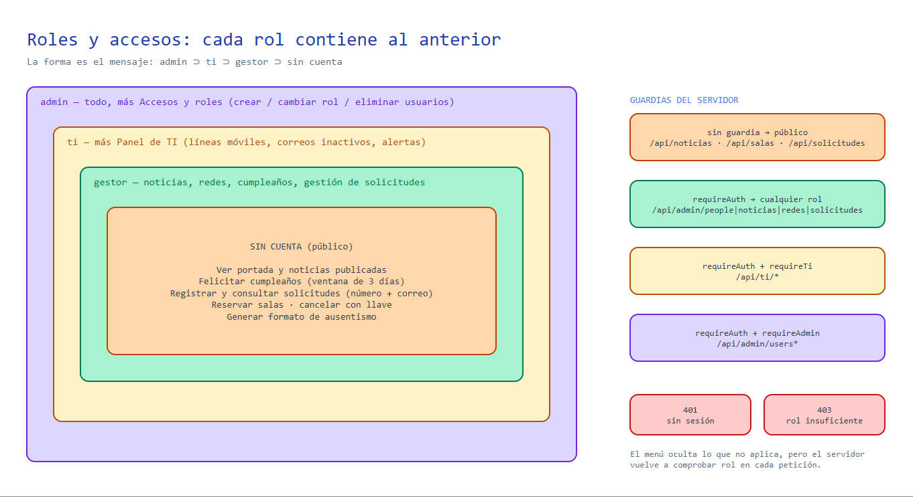

# Usuarios y permisos

> **Para quién es:** quien administra accesos, audita quién puede hacer qué, o necesita entender **cómo viaja
> la información entre el equipo de la persona y el servidor** y **por qué el control de accesos se diseñó así**.

Diagrama: [diagramas/roles-y-accesos.excalidraw](diagramas/roles-y-accesos.excalidraw).



## Idea central

La intranet tiene **dos zonas**:

- **Zona pública (sin cuenta):** cualquier persona de la empresa que abra la intranet ve la portada, las
  noticias publicadas, los cumpleaños, puede felicitar, registrar solicitudes, reservar salas y descargar el
  formato de ausentismo. No se pide usuario para que usar la intranet no sea una barrera.
- **Zona de gestión (con cuenta):** publicar noticias, administrar cumpleaños, gestionar solicitudes, panel de
  TI y administración de usuarios. Aquí sí hay inicio de sesión y **tres roles**.

## Roles

| Rol | Es quien… | Alcance |
| --- | --- | --- |
| `gestor` | Comunicaciones / Talento Humano | Cumpleaños, noticias y comunicados, redes sociales, gestión de solicitudes |
| `ti` | Equipo de sistemas | Todo lo del gestor **más** el Panel de TI (líneas móviles y correos inactivos) |
| `admin` | Administración de la intranet | **Todo**, más Accesos y roles (crear, cambiar y eliminar usuarios) |

Los roles **se acumulan hacia arriba**: `ti` y `admin` pueden hacer todo lo que hace un `gestor`; `admin` puede
hacer todo lo de `ti`. Un rol desconocido o ausente en `users.json` se trata como `gestor`.

## Qué puede hacer cada rol

✅ permitido · — no permitido · 🔑 con la llave que recibió al crearlo

| Acción | Sin cuenta | gestor | ti | admin |
| --- | :---: | :---: | :---: | :---: |
| Ver portada, noticias **publicadas**, cumpleaños, redes | ✅ | ✅ | ✅ | ✅ |
| Ver un borrador de noticia | — | ✅ | ✅ | ✅ |
| Felicitar a un cumpleañero (en la ventana de 3 días) | ✅ | ✅ | ✅ | ✅ |
| Cambiar mi propia felicitación | 🔑 | ✅ | ✅ | ✅ |
| Registrar una solicitud (ingreso, orden, préstamo) | ✅ | ✅ | ✅ | ✅ |
| Consultar una solicitud | ✅ (número + correo) | ✅ | ✅ | ✅ |
| Reservar una sala | ✅ | ✅ | ✅ | ✅ |
| Cancelar una reserva | 🔑 | ✅ cualquiera | ✅ cualquiera | ✅ cualquiera |
| Generar el formato de ausentismo | ✅ | ✅ | ✅ | ✅ |
| Crear, editar, publicar y eliminar **noticias/comunicados** | — | ✅ | ✅ | ✅ |
| Editar **enlaces de redes sociales** | — | ✅ | ✅ | ✅ |
| Administrar **cumpleaños** (alta, edición, publicar, carga masiva, moderar muro) | — | ✅ | ✅ | ✅ |
| Ver y gestionar **solicitudes** (estado, reenviar, descargar Excel) | — | ✅ | ✅ | ✅ |
| **Panel de TI** (líneas, correos inactivos, alertas, configuración) | — | — | ✅ | ✅ |
| **Accesos y roles** (crear/editar/eliminar usuarios, cambiar rol o contraseña de otros) | — | — | — | ✅ |
| Cambiar **mi** contraseña | — | ✅ | ✅ | ✅ |

**Reglas especiales de acceso**

- **Siempre debe quedar al menos un `admin`.** No se puede quitar el rol ni eliminar al último administrador.
- **Nadie puede eliminarse a sí mismo.**
- **Nombres de usuario únicos sin distinguir mayúsculas** (`Ana` = `ana`); de 3 a 32 caracteres: letras,
  números, punto, guion y guion bajo.
- **Contraseña:** mínimo 8 caracteres, tanto al crear como al cambiar.
- **Bloqueo por intentos:** 8 inicios de sesión fallidos desde la misma IP en 15 minutos → espera de 15 min.
- **Al iniciar sesión, cada rol aterriza en su panel:** `admin` → Administración, `ti` → Panel de TI.
- **El menú lateral solo muestra lo que el rol puede usar**, pero eso es **comodidad, no seguridad**: cada ruta
  del servidor vuelve a comprobar la sesión y el rol.
- **Cambiar el rol de alguien surte efecto de inmediato**, porque en cada petición el servidor vuelve a leer al
  usuario de `users.json`. Eliminar a un usuario también invalida su sesión al instante.
- **Una contraseña cambiada no cierra sesiones ya abiertas** (la sesión es un token firmado, no un registro en el
  servidor). Para expulsar a todos, cambia `SESSION_SECRET` y redespliega.

### Cómo se aplica en el servidor

| Guardia | Efecto | Se usa en |
| --- | --- | --- |
| *(ninguna)* | Público | `/api/birthdays`, `/api/noticias`, `/api/redes`, `/api/solicitudes/*` (registro y consulta), `/api/salas/*`, `/api/documentos/ausentismo`, `/api/auth/login` |
| `sesionOpcional` | Público, pero si hay sesión se reconoce | Ver borradores, cancelar reservas ajenas |
| `requireAuth` | Cualquier rol con sesión → si no, **401** | `/api/admin/people*`, `/api/admin/noticias*`, `/api/admin/redes`, `/api/admin/solicitudes*`, `/api/auth/password` |
| `requireAuth` + `requireTi` | Solo `ti` y `admin` → si no, **403** | `/api/ti/*` |
| `requireAuth` + `requireAdmin` | Solo `admin` → si no, **403** | `/api/admin/users*` |

## Cómo se crean los usuarios

1. **Iniciales:** al arrancar por primera vez, el servidor crea `gestor`, `ti` y `admin` a partir de las
   variables `GESTOR_*`, `TI_*` y `ADMIN_*`. Solo se crea un usuario si **no existe ya** con ese nombre. En
   producción, sin variables no se crea nada (ver [despliegue.md](despliegue.md)).
2. **Después:** un `admin` entra a **Administración → Accesos y roles** y crea, cambia de rol, restablece la
   contraseña o elimina usuarios. No hace falta tocar el servidor.
3. **Almacenamiento:** `users.json` guarda `{ username, name, role, password }`. La contraseña **nunca** se guarda
   ni se devuelve en claro: es `scrypt` con sal aleatoria por usuario, y la API solo devuelve
   `username`, `name` y `role`.

---

## Cómo se comunican los equipos y cómo viaja la información

Este apartado responde a: *¿cómo es el proceso de captura de datos y cómo se comunican los equipos?*

```
 PC de la persona                      Servidor (Railway)                       Disco
┌───────────────────┐   HTTPS + JSON   ┌───────────────────────┐   lee/escribe  ┌──────────────┐
│ Navegador         │ ───────────────► │ Express  /api/*       │ ─────────────► │ DATA_DIR     │
│ React (formulario │ ◄─────────────── │  1. ¿hay sesión?      │ ◄───────────── │  *.json      │
│ + validación)     │  respuesta/cookie│  2. ¿tiene el rol?    │                │  uploads/    │
└───────────────────┘                  │  3. valida de nuevo   │                │  solicitudes/│
                                       │  4. guarda y responde │                └──────────────┘
                                       └───────────────────────┘
```

**Los equipos no se comunican entre sí.** Cada computador solo habla con **un servidor central** mediante
peticiones HTTP con JSON. Cuando una persona publica una noticia, las demás la ven porque su navegador le pide
la lista al servidor, no porque se la envíe el otro equipo.

### El recorrido de un dato (ejemplo: registrar una solicitud)

1. **Captura en el navegador.** La persona llena un formulario; el mismo código de `shared/` valida mientras
   escribe y marca los campos con error.
2. **Envío.** El navegador manda `POST /api/solicitudes/<tipo>` con el JSON del formulario. La cookie de sesión
   viaja sola si existe (aquí no hace falta).
3. **Validación en el servidor.** El servidor **vuelve a validar** con las mismas reglas; nunca confía en lo
   que hizo el navegador.
4. **Guardado.** Se asigna el consecutivo y se escribe en `solicitudes.json` dentro de una cola (una escritura a
   la vez).
5. **Efectos.** Se genera el Excel y se envía el correo (o se guarda como `.eml` si no hay SMTP).
6. **Respuesta.** Devuelve la vista pública de la solicitud (sin datos sensibles) con su número.

### El recorrido de un acceso (inicio de sesión)

1. `POST /api/auth/login` con usuario y contraseña.
2. El servidor busca al usuario, calcula `scrypt` con la sal guardada y compara en **tiempo constante**.
3. Si coincide, emite una **cookie `gys_session`**: `HttpOnly` (JavaScript no la lee), `SameSite=Lax`,
   `Secure` en producción, vigencia de 12 h. Contiene `{usuario, expiración}` firmado con HMAC-SHA256.
4. En cada petición protegida, el servidor **verifica la firma y la expiración**, busca al usuario en
   `users.json` y comprueba el rol. Si algo falla: 401 (sin sesión) o 403 (sin permiso).

### Si un equipo está en la red local

En desarrollo, un compañero puede abrir `http://<IP-del-equipo>:5173` (Vite con `--host`) y su navegador habla
con la API a través del proxy de Vite. En producción no aplica: todos entran por el dominio público de Railway.

---

## Cómo se llegó a esta solución

> Esta sección explica el **razonamiento de diseño** a partir de lo que dice el código y de las restricciones
> que impone. Si el contexto original fue distinto, ajústala: el objetivo es que quien la lea entienda el
> porqué, no solo el cómo.

**El problema.** Muchas personas necesitan usar la intranet (pedir cosas, reservar, felicitar), pero solo
unas pocas deben poder publicar, ver solicitudes de otros o tocar datos de TI. Además, el equipo que la
mantiene es pequeño y no hay un servicio de identidad corporativo (Active Directory, SSO) conectado.

| Decisión | Alternativas consideradas | Por qué se eligió |
| --- | --- | --- |
| **Público por defecto, login solo para gestionar** | Exigir login a todos | Cualquier fricción para pedir una sala o un formato hace que la gente vuelva al WhatsApp. El riesgo de lo público se controla con límites por IP y llaves |
| **Tres roles acumulativos** (`gestor` ⊂ `ti` ⊂ `admin`) | Permisos por módulo, o roles sueltos | Hay tres perfiles reales en la operación; los permisos por módulo agregarían una pantalla de configuración que nadie mantendría |
| **Usuarios propios en `users.json`** | SSO / Google / Microsoft | No hay un directorio corporativo disponible; una cuenta local se crea en un minuto desde el panel y no depende de terceros |
| **Cookie firmada sin estado (HMAC)** | Sesiones en servidor o JWT con librería | No hay base de datos ni Redis; una cookie firmada no necesita almacenar nada y evita dependencias. El costo (no poder revocar una sesión suelta) se acepta porque **el rol y la existencia del usuario se releen en cada petición** |
| **`scrypt` con sal por usuario** | Guardar hash simple o texto | Viene en Node (`crypto`), sin dependencias, y es costoso de atacar por fuerza bruta |
| **Doble validación (`shared/`)** | Solo en el navegador | El navegador se puede saltar; el servidor es quien manda. Escribir la regla una vez evita que ambos lados se desincronicen |
| **Llaves (`key`) para felicitaciones y reservas** | Cuentas para todos | Permiten «editar lo mío» sin tener usuario: quien creó el dato recibe un secreto que solo él conoce |
| **Límites por IP** (login, felicitaciones, reservas, solicitudes) | Captcha | Frenan abusos sin molestar a las personas; los topes son altos porque **toda la oficina comparte IP** |
| **Un solo servidor y archivos JSON** | Base de datos, microservicios | El volumen es bajo y así se despliega con un solo servicio y sin migraciones (ver [erd.md](erd.md#por-qué-archivos-json)) |

**Riesgos que conviene conocer**

- Los usuarios iniciales de desarrollo (`admin/admin`, etc.) **no existen en producción**; no los uses fuera del
  equipo local.
- No hay **autenticación de dos factores** ni **registro de auditoría** de quién cambió qué (solo el historial
  de estado de las solicitudes y el `autor` de cada noticia).
- El límite por IP es en memoria: se reinicia con el servidor.
- Todo depende de un **único proceso**; ver la advertencia de réplicas en [despliegue.md](despliegue.md).
